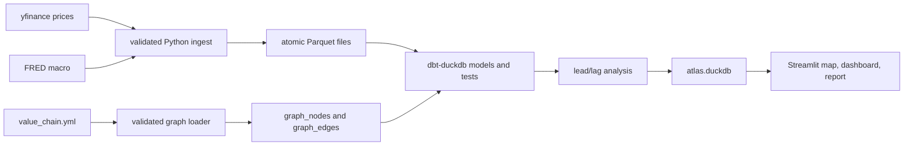

# Atlas

Atlas maps the AI value chain and shows where to look with reproducible,
quality-checked, free data.

Live demo: _Streamlit Cloud URL pending._

## Quickstart

```bash
make setup && make all && make app
```

## Architecture

The implementation follows the lean, reproducible architecture described in the
[design spec](../docs/superpowers/specs/2026-06-02-atlas-value-chain-design.md).



`value_chain.yml` is the single source of truth for the value-chain graph.
`ingest/graph.py` validates it and writes `graph_nodes` and `graph_edges` into
DuckDB before dbt consumes them as sources.

## Data Refresh

The nightly GitHub Actions job runs the full pipeline and publishes an immutable,
timestamped GitHub Release such as `data-2026-06-02T040000Z`. Each release
contains `atlas.duckdb` and a `manifest.json` with the schema version, asset URL,
SHA-256 checksum, and row counts.

Publishing is atomic: the job creates a draft release, uploads all assets,
downloads the uploaded database back for checksum verification, and publishes
only after verification passes. Retention deletes whole releases, keeping the
latest 14. The app resolves the newest valid remote release and falls back to the
previous valid release with a staleness banner when needed.

## v1 to v2 Rebuild

Atlas v2 is a clean-room restart, not a refactor or code port. It was built fresh
under `atlas/` without reusing v1 code, data, environment files, or
infrastructure. The legacy `ai-value-chain-data/` tree remains reference-only.
Its archive move is intentionally pending the Phase 0 credential-rotation gate
and will be handled as a dedicated human step.

## Non-Goals

1. **Not a trading system** — no backtesting, execution, portfolio optimization, or P&L.
   It surfaces hypotheses/descriptive signals; it does not trade.
2. **Lead/lag is exploratory, not predictive** — no ML forecasting, no claimed alpha,
   explicit correlation≠causation caveats.
3. **Daily granularity is the backbone** — no real-time/streaming in the core pipeline.
4. **Free data sources only** — yfinance, FRED, EDGAR. No Bloomberg/Refinitiv; no
   point-in-time / survivorship-bias-corrected data; history bounded by free APIs.
5. **No web scraping** of analyst notes / report PDFs — structured APIs and filings only.
6. **Single-machine scale** — DuckDB, dozens–low-hundreds of tickers; no distributed
   compute, no lakehouse (Iceberg/Delta).
7. **No multi-user / auth / accounts / billing.**
8. **No heavy orchestration** — Makefile + GitHub Actions cron is the ceiling; no
   Airflow/Prefect.
9. **Geopolitical concentration risk** (Taiwan/Netherlands) is captured as graph
   metadata + narrative, not a quantitative risk model.
10. **Hosting is best-effort** — free Streamlit Cloud sleeps when idle; not an HA
    service. Desktop layout, not mobile-polished.

**One-line scope:** Atlas maps the AI value chain and shows *where to look* with
reproducible, quality-checked, free data — it does **not** tell you what to trade,
predict prices, or run as production infrastructure.
